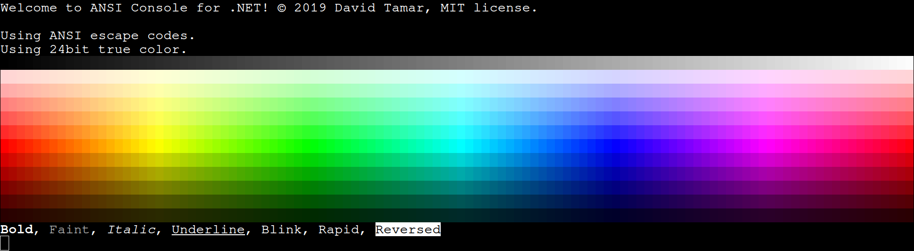

# ANSI Console
## Introduction
`ANSIConsole.Console` re-implements the `System.Console` class so properties like `Console.ForeColor` would rather take in values from the `Color` class with 24-bit RGB colors than the basic 16 `ConsoleColor`s, and adapt these colors to the limitations of the given terminal emulator.



## Current features
- Automatic detection and use of:
  - ANSI escape codes.
  - 256 colors sequences.
  - 24-bit true color sequences.
- ANSI sequences for _italic_, **bold**, underlined, blink, and faint text.
- Resort to nearest system colors or xterm colors when no support for advanced colors is provided by the terminal.
- Turn usage for escape codes, 256 colors, and true colors imperatively.

## Color support
If the current terminal does not support true color, it will resort to the standard ANSI 256 color palette. 

If ANSI colors are not supported, but escape codes are, then it will resort to xterm's base 16 colors with bright and dark variants. 

If escape codes are not supported either, then it will resort to .NET's basic system colors by utilizating the `ConsoleColor` enum.

## Terminal support
True color support is determined by the `truecolor` environment variable, which is supplied by the terminal emulator in question. 

256 colors support is determined by the `TERM` environment variable for values that include `256color` in them, such as `xterm-256color`.

Escape code support is determined by the `TERM` environment variable as well. ANSI console tries to search for known terminal types such as `xterm`, `linux` and `vt100` to ensure escape code support. 

**If support for ANSI escape codes is uncertain**, then ANSI console will virtually take **no effect and skip all escape-code-depended formatting**, except for colors which will be handled by .NET's standard `System.Console` class.

## Example
#### Import ANSI console
ANSI Console's use is fairly similar to .NET's standard console use. With slightly different names to some properties such as `Console.ForeColor` instead of `Console.ForegroundColor` and the presence of new switchable properties such as `Console.Italic` or `Console.Blink` to indicate specific ANSI formatting styles.

A `using` alias directive should be declared at each source file that makes use of `ANSIConsole.Console` in order to prevent confusion between the standard base class and `ANSIConsole`'s class.

```
using Console = ANSIConsole.Console;
```

#### Text formatting
```
Console.Italic = true;
Console.WriteLine("Italic text");

Console.Bold = true;
Console.WriteLine("Italic & bold text");

Console.Italic = false;
Console.WriteLine("Bold text");

Console.ResetStyle();
Console.WriteLine("Normal text");

Console.ForeColor = Color.MediumPurple;
Console.BackColor = Color.MidnightBlue;

Console.WriteLine("Light purple text over dark blue background.")
Console.ResetColor();
```
As you may notice, multiple formatting ANSI sequences can be applied simoultanously over the current state, and ANSI Console will run an SGR sequence update every time the formatting is being changed by color or by style (as long as the terminal is able to support escape codes).

#### Turn on/off features
You may enable or disable certain features at runtime as shown in the following example.
```
Console.EnableEscapeCodes = true;
Console.Enable256Colors = true;
Console.EnableTrueColor = true;
Console.WriteLine("True color:");
PrintColors();

Console.EnableTrueColor = false;
Console.WriteLine("256 colors:");
PrintColors();

Console.Enable256Colors = false;
Console.WriteLine("16 xterm colors:");
PrintColors();

Console.EnableEscapeCodes = false;
Console.WriteLine("ConsoleColor:");
PrintColors();

Console.EnableEscapeCodes = true;
Console.Enable256Colors = true;
Console.EnableTrueColor = true;
```
