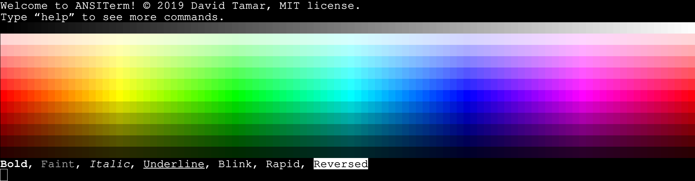

# ANSITerm
## Introduction
`ANSITerm.Console` re-implements the `System.Console` class so properties like `Console.ForegroundColor` would rather take values from the `Color` struct with 24-bit RGB colors than the basic 16 `ConsoleColor`s, and adapt these colors to the limitations of the given terminal emulator using ANSI escape codes.



## Current features
- Automatic detection and use of:
  - ANSI escape codes.
  - 4-bit (16 colors) XTerm palette sequences<sup>[[details]](#XTermPalette)</sup>.
  - 8-bit (256 colors) ANSI palette sequences<sup>[[details]](#ANSIPalette)</sup>.
  - 24-bit True Color sequences.
- XTerm sequences for _italic_, **bold**, underlined, blink, rapid-blink,reverse color, and faint text formatting styles<sup>[[inconsistent support]](#XTermStyles)</sup>.
- Automatic conversion to the nearest 4-bit or 8-bit colors when the terminal does not support 24-bit true color. The algorithm is quite fast and it calculates via the RGB values and keeps a cache dictionary.
- Turn on/off features or ignore their terminal support through imperative commands within your code.
- `Write`/`WriteLine`/`ReadLine` method overloads with foreground and background color parameters to appease the usual code bloat with imperative console formatting.

## Terminal support
If support for ANSI escape codes is uncertain, then *ANSITerm* will virtually **take no effect and skip all escape-code-depended formatting**, except for colors which will be converted to the nearest 4-bit color and passed as .NET's default `System.ConsoleColor`.

**Escape codes support** is determined by the `TERM` environment variable. *ANSITerm* tries to search for known terminal types such as `xterm`, `linux` and `vt100` to ensure escape code support.

**8-bit color support** is determined by the `TERM` environment variable for values that include `256color` in them, such as `xterm-256color`.

**24-bit color support** is determined by `COLORTERM` environment variable, which is usually set to `truecolor` by the terminal emulator in question. 

**XTerm formatting support** (including style formatting) is determined by escape code support alone.

### Ignore terminal support
If you are certain that you managed to identify your terminal within your code however *ANSITerm* has failed to detect your terminal, then you may instruct *ANSITerm* to ignore its own terminal support and enable escape codes anyway by setting the `Feature.IgnoreSupport` property to `true` in `Console.Config`.

Use this with caution. If you haven't identified the terminal properly then the user may see escape characters printed all over the buffer and this will render your application unusable on certain terminals that do not support ANSI escape codes to their full extent as you may have expected.

Turn `IgnoreSupport` only if you're 100% certain that you've managed to detect a terminal that supports the features you need but *ANSITerm* fails to detect them automatically. It's also a good idea to allow the user to turn on or off this behavior via external configuration.

## Color support
### 24-bit True Color
If the current terminal supports 24-bit colors, then *ANSITerm* will use *SGR sequences*<sup>[[what is SGR?]](#WhatIsSGR)</sup> for RGB colors<sup>[[alpha emitted]](#AlphaRGB)</sup> without performing any conversions to the nearest 8-bit/4-bit color.

### 8-bit (256 colors) ANSI palette
If *ANSITerm* can't determine support for 24-bit colors in the current terminal, then it will resort to ANSI's standard 8-bit 256 colors palette with nearest-color conversions. 

### 4-bit (16 colors) XTerm palette
If *ANSITerm* can't determine support for 8-bit colors, but escape codes are supported, then it will resort to XTerm's base 4-bit 16 colors with bright and dark variants with nearest-color conversions.

# 4-bit (16 colors) System.ConsoleColor
If escape codes are not supported at all, then it will resort to .NET's basic system colors by utilizing the well known `ConsoleColor` enum and nearest-color conversions.

### Windows 10 Command Prompt
I've tested CMD's escape code support on both Visual Studio and Rider and experienced different results, thus *ANSITerm* won't support escape codes on the Windows CMD by default. *Windows Terminal* is in *ANSITerm*'s todo list.

## Examples
#### Import ANSITerm.Console
`ANSITerm.Console`'s use is fairly similar to .NET's standard `System.Console` use. A `using` alias directive should be declared at each source file that makes use of `ANSITerm.Console` in order to prevent confusion between the standard base class and `ANSITerm`'s class.

```
using Console = Tamar.ANSITerm.Console;
```

#### Text formatting
Multiple formatting ANSI sequences can be applied simultaneously over the current state, and *ANSITerm* will run an SGR sequence<sup>[[what is SGR?]](#WhatIsSGR)</sup> update every time the formatting is being changed by color or by style (as long as the terminal is able to support escape codes).

Consider using the method overloads for `Write`, `WriteLine`, and `ReadLine` that include foreground and background parameters as shown below. They don't interfere with `ForegroundColor` or `BackgroundColor` and will revert back once they done printing.
```
Console.WriteLine("Red text over white background.", Color.Red, Color.White);
Console.WriteLine("Normal text");
Console.ReadLine(Color.DarkTeal); // The user's input is shown in dark teal as they type, and reverts back to the previous colors when they're done.
```

Toggle XTerm formatting styles (such as italic/bold/underline) the same way you would set colors.
```
Console.Italic = true;
Console.WriteLine("Italic text");

Console.Bold = true;
Console.WriteLine("Italic & bold text");

Console.Italic = false;
Console.WriteLine("Bold text");

Console.ResetStyle();
Console.WriteLine("Normal text");

Console.ForegroundColor = Color.MediumPurple;
Console.BackgroundColor = Color.MidnightBlue;
Console.WriteLine("Light purple text over dark blue background.")
Console.ResetColor();
```

#### Turn on/off features imperatively
You may enable or disable certain formatting features at runtime as shown in the following example.
```
Console.Config.EscapeCodes.Enable();
Console.Config.Colors8Bit.Enable();
Console.Config.Colors24Bit.Enable();

Console.WriteLine("Printed with 24-bit colors");
PrintColors();

Console.Config.Colors24Bit.Disable();
Console.WriteLine("Printed with 8-bit colors");
PrintColors();

Console.Config.Colors8Bit.Disable();
Console.WriteLine("Printed with 4-bit (16 colors) XTerm palette (using escape codes)");
PrintColors();

Console.Config.EscapeCodes.Disable();
Console.WriteLine("Printed with 4-bit (16 colors) System.ConsoleColor (no escape codes)");
PrintColors();

Console.Config.EscapeCodes.Enable();
Console.Config.Colors8Bit.Enable();
Console.Config.Colors24Bit.Enable();
```

## Backwards compatibility
*ANSITerm* is fully backwards-compatible. Since version **0.1.4** a number of changes were done to the public API, however the obsolete API is still there and re-routes everything to the new API to make sure that old properties and functions are still working as they worked before.

You can read more details about why, where they moved, or what happened to each deprecated member within the XML documentation in `ANSITerm.Console` attached to each deprecated member.

## Notes
<a name="XTermStyles">**Inconsistent support for XTerm styles**</a>: 
Not all terminals support XTerm's text formatting to full extent. *ANSITerm* doesn't have any mechanism to detect proper support of text formatting beyond basic support for ANSI escape codes in general.

<a name="WhatIsSGR">**What is SGR?**</a>: 
The term “*SGR*” stands for “**S**elect **G**raphic **R**endition” as specified by ECMA. This sequence is responsible for all graphical changes on the buffer, including color and text formatting. You can find more details about SGR in the **[ECMA-48](https://www.ecma-international.org/publications/standards/Ecma-048.htm)** specification paper.

<a name="AlphaRGB">**Alpha is emitted from RGB colors**</a>:
The transparency component of A-RGB colors is ignored for SGR sequences, however fully transparent colors (i.e. `Color.Transparent` indicates the default (no color) for both: foreground and background settings. `Console.ResetColor` will set both of them to `Color.Transparent`. Every time the SGR sequence will be updated, transparent colors will be ignored and skipped thus resulting in the default colors as set by the terminal emulator.

<a name="ANSIPalette">**ANSI's palette**</a>:
ANSI's palette includes 256 colors in total. The first 16 colors correspond to the well known bright/dark shades of the 4-bit system colors as presented by `System.ConsoleColor`. The last 24 colors are gray-scale only, and the 216 colors in between (6*6*6) are non-gray-scale. Some colors have duplicates. When performing nearest-color conversion, *ANSITerm* will consider the entire spectrum, including the gray-scale for non-gray-scale colors and vice-versa.

<a name="XTermPalette">**XTerm's palette**</a>:
This palette includes 16 colors in total and is equivalent to `System.ConsoleColor`'s palette. There are 8 pigments with 2 shades each - bright and dark. The SGR byte values for XTerm's palette are separated in different ranges for foreground and background colors by bright and dark shades. In some terminals the bold sequence turns on the bright shade for the current foreground color, however this behavior doesn't follow the specification as required.

## License
*ANSITerm* is under MIT License, © 2019 David Tamar. 

See [LICENSE](LICENSE) for details.